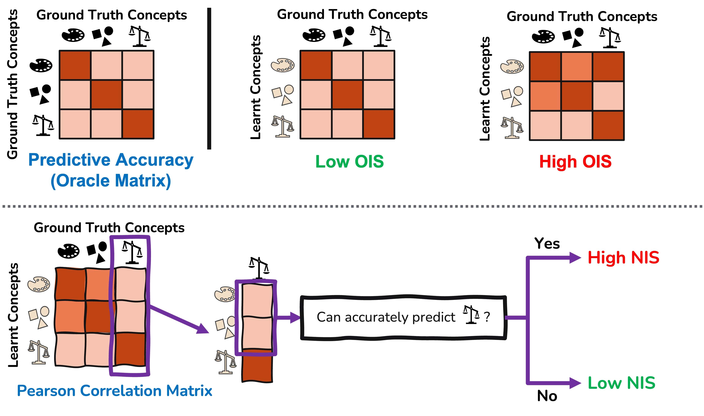

# Towards Robust Metrics For Concept Representation Evaluation
[](https://github.com/mateoespinosa/concept-quality/blob/main/LICENSE) [](https://www.python.org/downloads/release/python-370/) [](https://arxiv.org/abs/2301.10367) [](https://github.com/mateoespinosa/concept-quality/blob/main/media/poster.pdf) [](https://github.com/mateoespinosa/concept-quality/blob/main/media/slides.pptx)

<!-- [](media/video.mp4)  -->




Official code for our paper "[**Towards Robust Metrics For Concept Representation Evaluation**](https://arxiv.org/abs/2301.10367)"
accepted at [**The 37th Association for the Advancement of Artificial Intelligence Conference on Artificial Intelligence (AAAI)**](https://aaai.org/Conferences/AAAI-23/) as an **oral** presentation.


This work was done by [Mateo Espinosa Zarlenga<sup>\*</sup>](https://mateoespinosa.github.io/),
[Pietro Barbiero<sup>\*</sup>](https://www.pietrobarbiero.eu/),
[Zohreh Shams<sup>\*</sup>](https://zohrehshams.com/),
[Dmitry Kazhdan](https://scholar.google.com/citations?user=MSFAgbkAAAAJ&hl=en),
[Umang Bhatt](https://umangsbhatt.github.io/),
[Adrian Weller](http://mlg.eng.cam.ac.uk/adrian/),
[Mateja Jamnik](https://www.cl.cam.ac.uk/~mj201/)

#### TL;DR

We show that commonly used concept-learning self-explaining models,
such as [Concept Bottleneck Models (CBMs)](https://arxiv.org/abs/2007.04612), can be severely affected by underlying
"impurities" accidentally encoded within their concept representations (similar
to those empirically found by [Mahinpei et al.](https://arxiv.org/abs/2106.13314)). These impurities can
lead to concept-learning models underperforming when experts intervene in their
predicted concepts and accidentally capturing spurious correlations. To enable
researchers and users of concept learning models to detect when such impurities may
jeopardize their model's performance and interpretability, we
propose two novel metrics that capture how such impurities are captured (1) within
single concepts and (2) across multiple concept representations.

#### Abstract

Recent work on interpretability has focused on concept-based
explanations, where deep learning models are explained in terms of high-level
units of information, referred to as concepts. Concept learning models, however,
have been shown to be prone to encoding impurities in their representations,
failing to fully capture meaningful features of their inputs. While concept
learning lacks metrics to measure such phenomena, the field of disentanglement
learning has explored the related notion of underlying factors of variation in
the data, with plenty of metrics to measure the purity of such factors. In
this paper, we show that such metrics are not appropriate for concept learning
and propose novel metrics for evaluating the purity of concept representations
in both approaches. We show the advantage of these metrics over existing ones
and demonstrate their utility in evaluating the robustness of concept
representations and interventions performed on them. In addition, we show their
utility for benchmarking state-of-the-art methods from both families and find
that, contrary to common assumptions, supervision alone may not be sufficient
for pure concept representations.

# Citation

If you use our work or code for your own research, please cite this work as:
```
@article{zarlenga2023towards,
  title={Towards Robust Metrics for Concept Representation Evaluation},
  author={Espinosa Zarlenga, Mateo and Barbiero, Pietro and Shams, Zohreh and Kazhdan, Dmitry and Bhatt, Umang and Weller, Adrian and Jamnik, Mateja},
  journal={arXiv preprint arXiv:2301.10367},
  year={2023}
}
```


# Installation

This directory contains all the code required to reproduce the results we
discuss in our AAAI 2023 submission "Towards Robust Metrics For Concept
Representation Evaluation". All of our code was built on top of the public
library by [Kazhdan et al.](https://github.com/dmitrykazhdan/concept-based-xai)
and we attribute any external implementations used during our development both
in our Appendix and in comments throughout our code. We also based
our disentanglement learning experiments on the open-sourced implementations of
disentanglement learning metrics by [Locatello et al](https://github.com/google-research/disentanglement_lib)
and [Ross et al.](https://github.com/dtak/hierarchical-disentanglement).

## Requirements

- Python 3.7 - 3.8
- See 'requirements.txt' for the rest of required packages


To install the modified library, please proceed by running the following
command:
```bash
python setup.py install
```
This will install the `concepts-xai` package, with changes to it that include
our metric implementations and models, together with all their dependencies.

To test that the package has been successfully installed, you can run:
```python
import concepts_xai
help("concepts_xai")
```
to display all the subpackages included from this installation.

## Datasets

If you want to recreate our dSprites and 3dShapes experiments, please download
the datasets to your local directory by running:
```bash
cd experiments/ && ./download_datasets.sh && cd -
```
Our toy tabular experiments do not require any special downloads.

# Main Functions
The main implementations of our two metrics, the oracle and niching impurity
scores, can be imported as follows:

1. **Oracle Impurity Score (OIS)**: you can compute the OIS of a matrix  of soft
 concept representations using the following code:
 ```python
 from concepts_xai.evaluation.metrics.oracle import oracle_impurity_score

 ois = oracle_impurity_score(
    c_soft=test_concept_representations,  # Size (n_samples, concept_dim, n_concepts) or (n_samples, n_concepts)
    c_true=test_concept_labels,  # Size (n_samples, n_concepts)
 )
 ```

2. **Niche Impurity Score (NIS)**: you can compute the NIS of a matrix  of soft
 concept representations using the following code:
  ```python
 from concepts_xai.evaluation.metrics.niching import niche_impurity_score

 ois = niche_impurity_score(
    c_soft=test_concept_representations,  # Size (n_samples, concept_dim, n_concepts) or (n_samples, n_concepts)
    c_true=test_concept_labels,  # Size (n_samples, n_concepts)
 )
 ```


# Experiments

All of our experiments can be reproduced by running the iPython notebooks
included in `experiments/` (each notebook's name is aligned to the relevant
experiment we ran). It is important that the experiments involving our oracle
impurity (OIS) benchmarks are ran **before** running those for niching impurity
(NIS). Therefore, please run the notebook
`oracle_impurity_benchmark_X.ipnb` before running a notebook named
`niching_impurity_benchmark_X.ipnb`. This is because the models trained for computing
our OIS results will be used in the OIS benchmarking to speed things up.
